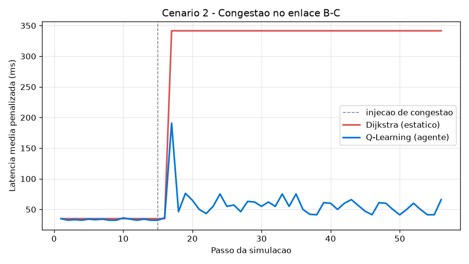
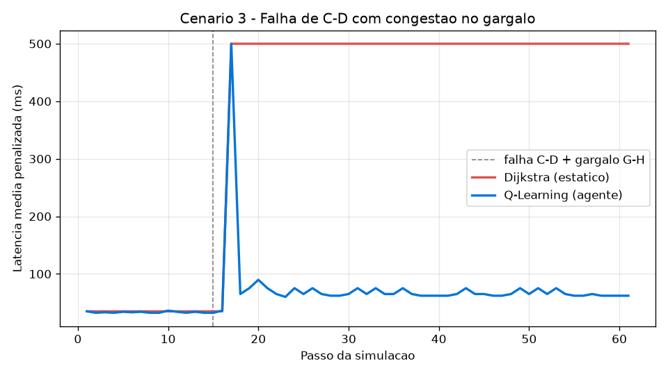
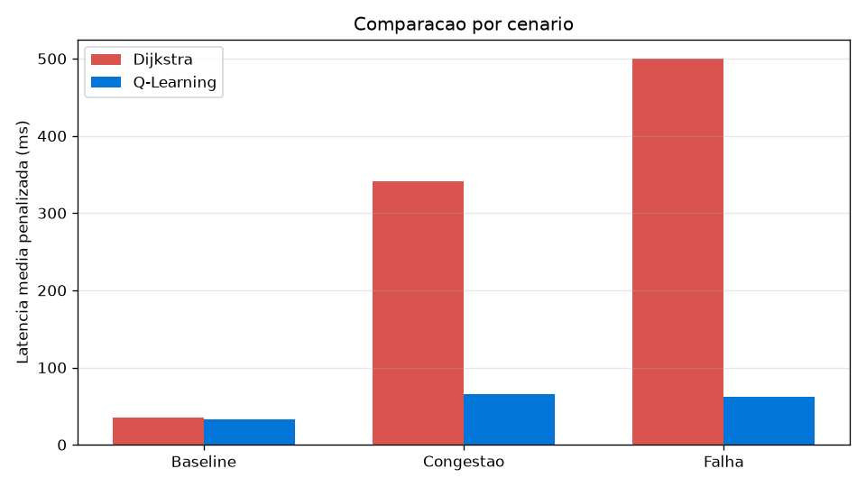

# Roteamento Inteligente com Agente de Aprendizado por Reforço

**Disciplina:** MATA59 (Redes de Computadores, UFBA)
**Professor:** Gustavo B. Figueiredo
**Tema:** Protocolos de Rede Inteligentes usando IA e Agentes. Roteamento Inteligente (Camada de Rede).

**Dupla:** _(preencher nomes)_

---

## 1. Introdução

As redes de computadores estão evoluindo de infraestruturas estáticas para
sistemas autônomos e programáveis. O roteamento, que decide por qual caminho o
tráfego passa entre dois pontos da rede, é um dos serviços mais críticos da
Camada de Rede. Historicamente ele é resolvido por algoritmos determinísticos de
caminho mais curto, como o **Dijkstra** empregado pelo protocolo **OSPF**.

Esses algoritmos são eficientes e provadamente ótimos para uma métrica fixa, como
número de saltos, latência de propagação ou custo administrativo. O problema é que
eles tomam decisões com base em um custo **estático** do enlace, que não reflete o
estado dinâmico da rede. Em especial, eles não enxergam o **congestionamento** que
acontece em tempo real.

Este trabalho investiga como um **agente autônomo baseado em aprendizado por
reforço (Q-Learning)** pode aprimorar o roteamento. O agente monitora a utilização
e a latência dos enlaces e **reroteia os fluxos dinamicamente** para evitar a
congestão e reagir a falhas. A solução é comparada diretamente com o roteamento
clássico de Dijkstra, atendendo ao critério de comparação com abordagens
tradicionais.

O objetivo é construir um sistema funcional que cumpra quatro pontos: simular uma
rede com tráfego e congestionamento; rotear o tráfego tanto por Dijkstra estático
quanto pelo agente Q-Learning; permitir injetar congestão e derrubar enlaces ao
vivo; e demonstrar visualmente o comportamento adaptativo do agente, medindo o
ganho em latência e em fluxos entregues.

---

## 2. Funcionamento do protocolo (roteamento clássico)

No roteamento por estado de enlace, usado pelo OSPF, cada roteador conhece a
topologia completa da rede e atribui a cada enlace um **custo** (a métrica). O
caminho escolhido entre uma origem e um destino é o de **menor custo total**,
calculado pelo algoritmo de **Dijkstra**. O funcionamento pode ser resumido em
quatro etapas:

1. cada enlace `(u, v)` recebe um peso `w(u, v)` fixo, por exemplo proporcional à
   latência de propagação ou inversamente proporcional à largura de banda nominal;
2. o Dijkstra computa a árvore de caminhos mais curtos a partir da origem;
3. o tráfego segue o caminho de menor custo até o destino;
4. o custo só é recalculado quando a **topologia** muda. Quando um enlace cai ou
   volta a operar, novas mensagens de estado de enlace (LSAs) são propagadas e a
   árvore de caminhos é recomputada.

Esse modelo é robusto, escala bem e converge para o caminho ótimo segundo a
métrica configurada. Foi exatamente esse comportamento que implementamos no
baseline (`src/routers/dijkstra_router.py`), usando `networkx.shortest_path` com
peso igual à **latência base** de cada enlace.

---

## 3. Problema identificado

O custo do enlace no roteamento clássico é **estático**: ele não incorpora a
**carga instantânea** que o enlace está transportando. Isso gera duas limitações
centrais.

A primeira é que o algoritmo **não reage ao congestionamento**. Se muitos fluxos
convergem para o mesmo caminho de menor custo, esse caminho satura, a latência de
fila dispara e passa a haver perda de pacotes. Mesmo assim o Dijkstra continua
enviando tráfego por ali, porque o peso do enlace não mudou. Na prática, o
algoritmo fica "cego" para a congestão que ele mesmo provoca.

A segunda é que o algoritmo **reage apenas à topologia, e não às consequências da
falha**. Quando um enlace cai, o Dijkstra reconverge para um novo caminho mais
curto. Se esse novo caminho concentra o tráfego de vários fluxos em um mesmo
gargalo, o resultado é congestão, que novamente passa despercebida.

Para tornar esse efeito mensurável, modelamos a latência efetiva de um enlace como
uma função crescente da utilização `u = carga / capacidade`, imitando o atraso de
fila de um sistema M/M/1 (`src/network.py`):

```
lat_efetiva = lat_base · (1 + α · u^β)
```

Com `α = 4` e `β = 2`, a latência cresce de forma acentuada quando `u` se aproxima
de 1. Consideramos um enlace **congestionado** quando `u ≥ 0,90` e assumimos que há
**perda** quando a demanda excede a capacidade (`u > 1`). É justamente essa
dinâmica de carga que o roteamento estático ignora.

---

## 4. Solução inteligente proposta

Propomos um **agente de roteamento por Q-Learning** (aprendizado por reforço
tabular), implementado em `src/routers/qlearning_router.py`. O roteamento é
formulado como um problema de decisão sequencial, com os seguintes elementos:

- **Estado:** o nó atual da rede. Mantemos **uma tabela Q por destino**, de modo
  que `Q_d[s][a]` estima a qualidade de, estando no nó `s` e indo para o destino
  `d`, escolher o vizinho `a` como próximo salto.
- **Ação:** escolher um vizinho (o próximo salto) entre os enlaces operacionais.
- **Recompensa:**

  ```
  r = − lat_efetiva(enlace)  − penalidade_por_salto
      − PENALIDADE_CONGESTAO   (se o enlace estiver congestionado)
      + BONUS_DESTINO          (ao alcançar o destino)
  ```

  Como a recompensa usa a **latência efetiva**, que depende da carga, o agente é
  penalizado por usar enlaces carregados e aprende a evitá-los.

- **Atualização (Q-Learning off-policy):**

  ```
  Q(s,a) ← Q(s,a) + α · [ r + γ · maxₐ' Q(s',a') − Q(s,a) ]
  ```

  com taxa de aprendizado `α = 0,5`, fator de desconto `γ = 0,9` e exploração
  **ε-gulosa** (`ε = 0,2`) durante o treino.

Quanto ao **monitoramento**, a cada passo da simulação o agente observa a carga e,
por consequência, a latência efetiva de cada enlace da rota que percorre. Essas são
as entradas que alimentam a recompensa.

Quanto às **ações executadas**, a saída do agente é a decisão de próximo salto em
cada nó. Encadeada da origem até o destino, essa sequência de decisões produz o
caminho de cada fluxo. Quando a rede muda, seja por congestão injetada ou por um
enlace derrubado, as recompensas mudam junto. Depois de alguns episódios de treino,
a política gulosa passa a escolher outro caminho, e é aí que ocorre o reroteamento
adaptativo.

Por fim, incluímos algumas **salvaguardas de engenharia** para garantir robustez:
um limite de saltos por episódio para evitar laços, a preferência por vizinhos
ainda não visitados durante a inferência e um caminho de contingência (fallback)
para a rota mais curta por latência base, usado caso o agente ainda não tenha
convergido para um dado destino. Com isso, a rede permanece conectada mesmo durante
o aprendizado.

---

## 5. Arquitetura da implementação

O sistema é modular e está organizado na pasta `src/`:

- **`network.py`** monta a topologia em `NetworkX` (9 roteadores, de A a I, com
  caminhos redundantes), define os atributos de enlace (`capacity`, `base_latency`,
  `load`, `up`) e implementa o modelo de latência e congestão.
- **`traffic.py`** define os fluxos de demanda `(origem, destino, banda)` e a
  rotina que roteia cada fluxo e acumula a carga nos enlaces, com suporte à injeção
  de carga que representa a congestão.
- **`routers/`** contém `dijkstra_router.py` (baseline) e `qlearning_router.py`
  (agente), ambos sob a interface comum de `base.py`.
- **`metrics.py`** calcula latência média e de pior caso, utilização máxima,
  número de enlaces congestionados, fluxos entregues e descartados, além da
  **latência penalizada**, na qual cada fluxo descartado conta como penalidade,
  para que descartar tráfego não "melhore" artificialmente a latência média.
- **`simulator.py`** é o motor por passos. A cada iteração ele avalia **os dois
  roteadores nas mesmas condições**, treina o agente sobre o estado atual da rede e
  expõe um snapshot para o dashboard. É ele também que aplica os eventos ao vivo
  (congestionar, derrubar, restaurar e resetar).
- **`app.py` e `static/`** formam o servidor Flask e o dashboard web, com o grafo
  interativo desenhado por `vis-network` e o gráfico de latência por `Chart.js`. O
  front-end consulta o estado por polling e envia os eventos.

```
        Fluxos de demanda                 Eventos ao vivo
        (A->D, E->H, A->H)        (congestionar / derrubar / restaurar)
                |                                 |
                v                                 v
        +----------------------------------------------+
        |                 Simulator                    |
        |   avalia Dijkstra e Q-Learning nas mesmas    |
        |   condicoes  ->  aplica carga  ->  metricas   |
        +---------------+---------------+--------------+
                        |               |
             Dijkstra (estatico)   Q-Learning (agente, treina a cada passo)
                        |               |
                        v               v
                    Dashboard Flask (grafo + metricas + grafico)
```

---

## 6. Experimentos

O script `experiments/run_experiments.py` executa três cenários, sempre comparando
os dois roteadores sob **as mesmas condições**:

1. **Baseline:** rede sem congestão nem falhas.
2. **Congestão:** injeção de carga no enlace **B-C**, que pertence à rota curta
   A→B→C→D (o fluxo destaque é A→D).
3. **Falha e gargalo:** queda do enlace **C-D** somada à concentração de tráfego no
   gargalo **G-H**, que simula o congestionamento provocado pela reconvergência do
   Dijkstra.

Em cada cenário registramos a evolução da latência penalizada passo a passo, os
caminhos escolhidos e as métricas finais. As saídas são gravadas em `results/`
(`cenario2_congestao.png`, `cenario3_falha.png`, `comparacao_barras.png` e
`resultados.csv`).

O dashboard (`python src/app.py`) permite reproduzir os mesmos eventos **ao vivo** e
observar a rota se redesenhar, e é a base da demonstração em vídeo.

---

## 7. Resultados

### 7.1 Baseline (sem congestão)

Os dois roteadores têm desempenho equivalente, com latência em torno de 32 a 35 ms
e todos os fluxos entregues. Isso é esperado, porque sem congestão o caminho mais
curto do Dijkstra também é uma boa escolha, e o agente acaba aprendendo
essencialmente a mesma política.

### 7.2 Congestão no enlace B-C



Ao injetar congestão em B-C (no passo 15), os comportamentos divergem. O
**Dijkstra** mantém a rota A→B→C→D, satura o enlace (utilização de cerca de 1,55) e
passa a **descartar 2 dos 3 fluxos**, com a latência penalizada saltando para cerca
de 341 ms e permanecendo alta. O **Q-Learning** sofre um pico breve e, em poucos
passos, **aprende a desviar** para A→E→F→G→C→D, entregando **todos os 3 fluxos** com
latência de aproximadamente 66 ms.

O gráfico deixa o aprendizado evidente: a curva azul do agente cai e estabiliza
logo após o evento, enquanto a curva vermelha do Dijkstra permanece no patamar
alto.

### 7.3 Falha de C-D com gargalo em G-H



Ao derrubar C-D e concentrar tráfego em G-H, o **Dijkstra** reconverge para
A→B→C→G→H→D, mas funila todos os fluxos no gargalo congestionado e acaba
**descartando os 3 fluxos** (utilização de cerca de 1,66). O **Q-Learning** desvia
pelo caminho alternativo que passa pelo nó **I** (A→…→F→I→H→D) e **entrega os 3
fluxos** com latência de aproximadamente 60 ms.

Este cenário resume o ponto central do trabalho: o Dijkstra reage à falha e muda de
rota, mas ignora o congestionamento resultante, ao passo que o agente percebe o
gargalo e o contorna.

### 7.4 Resumo comparativo



| Cenário | Dijkstra (lat. penalizada / descartes) | Q-Learning (lat. penalizada / descartes) |
|---|---|---|
| Baseline | ~35 ms / 0 | ~32 ms / 0 |
| Congestão B-C | ~341 ms / 2 | ~66 ms / 0 |
| Falha C-D + gargalo | 500 ms / 3 | ~60 ms / 0 |

---

## 8. Conclusão

O agente Q-Learning apresentou **comportamento adaptativo real**. Diante de
congestão ou de falhas que geram gargalos, ele reroteia o tráfego e mantém a
entrega dos fluxos com latência baixa, enquanto o roteamento estático de Dijkstra
insiste em caminhos saturados e descarta tráfego. O ganho é expressivo no cenário
de congestão (queda de cerca de 341 ms para 66 ms) e no de falha com gargalo (de 3
fluxos descartados para nenhum). A abordagem é totalmente automática e a tomada de
decisão é dinâmica, o que atende aos requisitos do trabalho.

Também identificamos limitações. O aprendizado tabular não escala para redes muito
grandes, já que o número de estados cresce com o produto de nós por destinos.
Existe um tempo de convergência após cada evento, pois a política leva alguns
episódios para se ajustar, o que aparece como o pico breve nos gráficos. A
exploração ε-gulosa introduz alguma variabilidade entre execuções. E o modelo de
congestão é uma aproximação analítica, não um simulador de pacotes completo.

Como trabalhos futuros, seria possível substituir a tabela Q por uma **Deep
Q-Network (DQN)** para generalizar a redes maiores, incluir a utilização dos
enlaces explicitamente no estado, adotar recompensas multiobjetivo (latência, perda
e balanceamento de carga) e validar a solução em um emulador de pacotes real como o
**Mininet**.

De modo geral, o experimento confirma a hipótese inicial: incorporar aprendizado
por reforço ao roteamento traz resiliência a congestão e a falhas que o roteamento
clássico, por ser estático, não oferece, e faz isso mantendo desempenho equivalente
quando a rede está descarregada.
